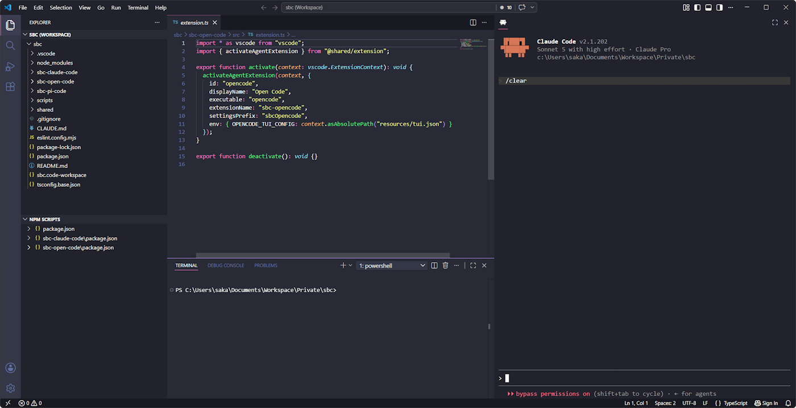

# SBC Claude Code

Sidebar terminal for running [Claude Code](https://docs.claude.com/en/docs/claude-code) inside VS Code — with live IDE context, session auto-resume, and finish notifications.

## Features

- **Sidebar terminal** — Claude Code runs in a real terminal (xterm.js + node-pty) inside a VS Code sidebar view, no separate terminal panel needed.
- **Live IDE context** — every prompt is automatically enriched with the active file, cursor position, current selection, open tabs (with unsaved-changes warnings), and diagnostics, so Claude Code always knows what you're looking at.
- **Session auto-resume** — reopening the sidebar in a workspace continues the most recent Claude Code session for that project.
- **Finish notifications** — a native OS notification (Windows/macOS/Linux, no extra software required) tells you when Claude Code finishes responding, needs permission, or is waiting for an answer.

## Requirements

- Claude Code CLI installed and available on `PATH` (or configured via `sbcClaude.agentPath`).

## Settings

| Setting | Default | Description |
|---|---|---|
| `sbcClaude.agentPath` | `claude` | Path or command name of the Claude Code executable. |
| `sbcClaude.notifications` | `true` | Show a native OS notification when Claude Code finishes responding. |

## Privacy

All context (active file, selection, diagnostics) is written to a local file and read by the Claude Code CLI process directly on your machine. Nothing is sent anywhere by this extension itself.
