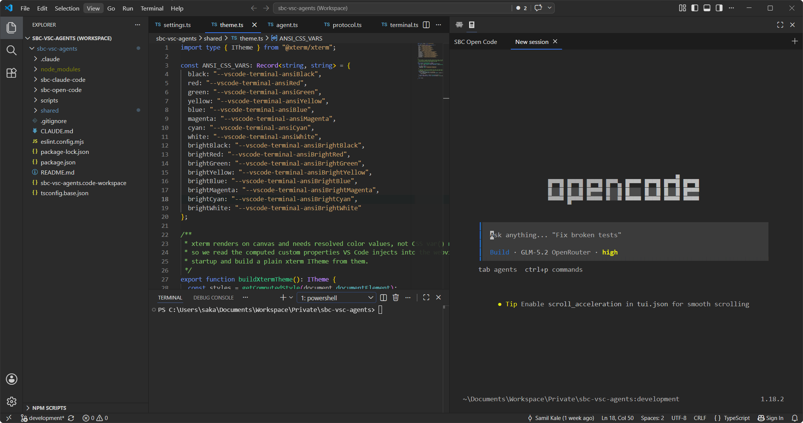

# SBC Open Code

Sidebar terminal for running [opencode](https://opencode.ai) inside VS Code — with session auto-resume built in.

## Features

- **Sidebar terminal** — opencode runs in a real terminal (xterm.js + node-pty) inside a VS Code sidebar view, no separate terminal panel needed.
- **Session auto-resume** — reopening the sidebar in a workspace continues the most recent opencode session for that project.

## Requirements

- opencode CLI installed and available on `PATH` (or configured via `sbcOpenCode.agentPath`).

## Settings

| Setting | Default | Description |
|---|---|---|
| `sbcOpenCode.agentPath` | `opencode` | Path or command name of the opencode executable. |
